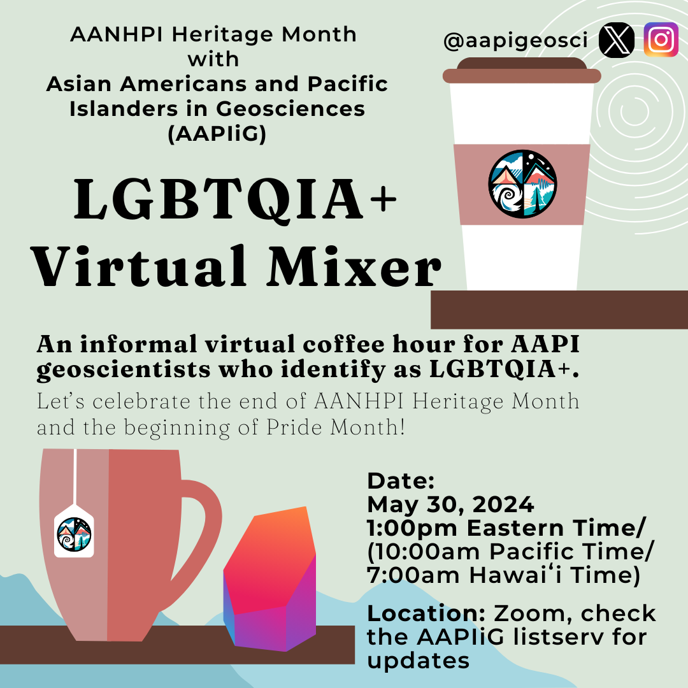
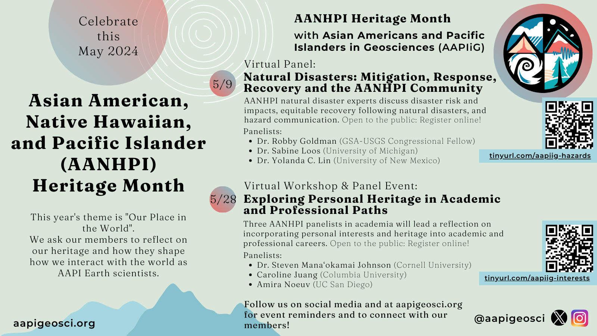
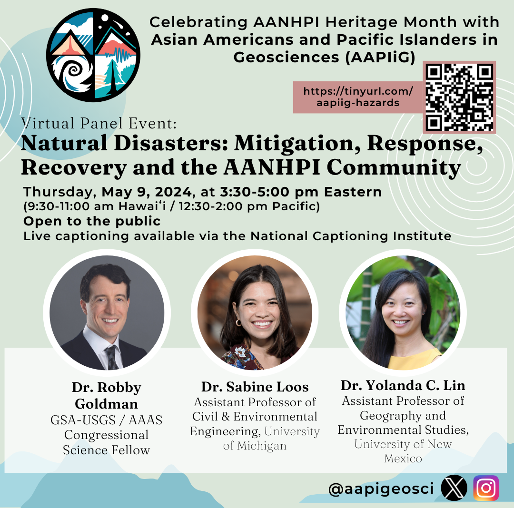
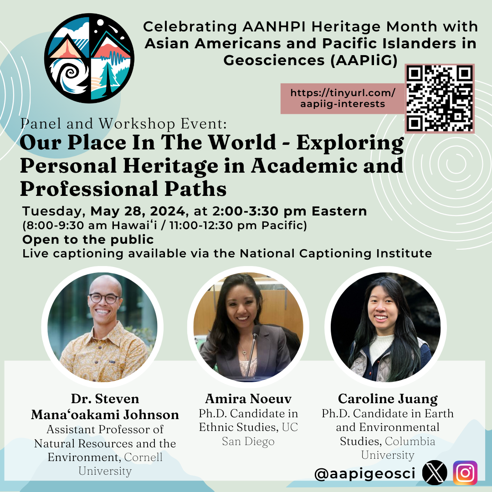
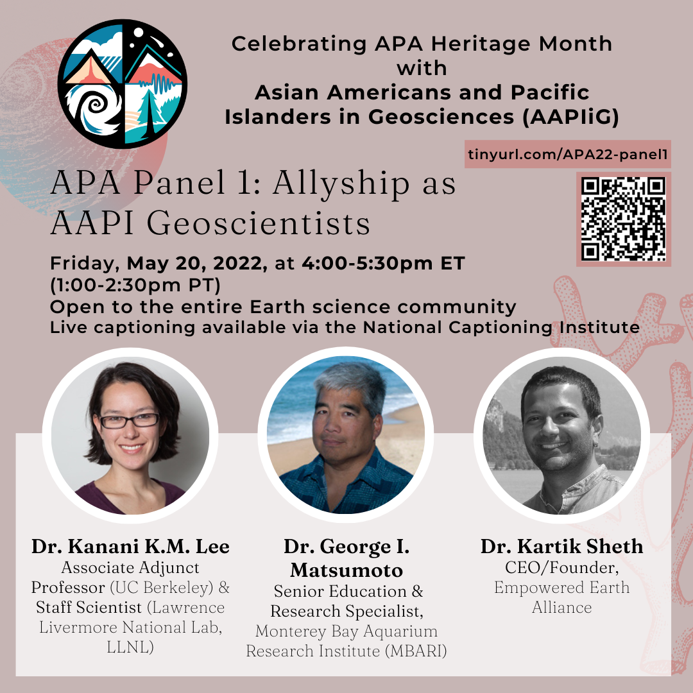

# LGBTQIA+ Virtual Mixer

<!---
# AAPIiG APA Heritage Month 2024 at a Glance

# Virtual Panel: Natural Disasters: Mitigation, Response, Recovery and the AANHPI Community

**Date:**
Thursday, May 9, 2024; 3:30 PM Eastern/12:30 PM Pacific/9:30 AM Hawaiʻi

**Description:**
This will be a 90 minute virtual webinar and is open to the public. We are featuring three AANHPI natural disaster experts who will discuss disaster risk and community impacts, equitable recovery following natural disasters, and hazard communication with the public and decision-makers. Our goal is to showcase scientists who have developed tangible connections between their research, affected communities and decision-makers.

**Panelists:**
- Dr. Robby Goldman is a GSA-USGS Congressional Fellow working in the office of U.S. Senator Mazie Hirono of Hawaii. Dr. Goldman’s responsibilities include monitoring Maui's post-wildfire-disaster recovery and exploring federal policies to mitigate Hawaii's risk for future wildfires. Website: https://robbygoldman.weebly.com/

- Dr. Yolanda Lin is an Assistant Professor in the Department of Geography and Environmental Studies at the University of New Mexico. Dr. Lin uses a mixed-methods approach in her work to better understand possible futures related to natural hazards and disasters. Website: https://www.yolandaclin.com/ 

- Dr. Sabine Loos is an Assistant Professor in the Civil and Environmental Engineering Department at University of Michigan. Dr. Loos applies statistical learning, risk analysis, and user-centered design techniques to develop tools that inform effective and equitable disaster risk reduction, response, and recovery. Website: https://sabine-loos.com/ 

Register [here](https://tinyurl.com/aapiig-hazards).

Questions about this event can be directed to Luan Heywood at luan.heywood@gmail.com. 

# Virtual Workshop: Exploring Personal Heritage in Academic and Professional Paths

**Date:**
Tuesday, May 28, 2024; 2:00 PM Eastern/11:00 AM Pacific/8:00 AM Hawaiʻi

**Description:**
This will be a 90 minute interactive virtual workshop and is open to the public. We are featuring three AANHPI researchers who have incorporated their personal interests and heritage into their academic work, with backgrounds in the geosciences, social sciences, and ethnic studies.

**Panelists:**
- Dr. Steven Mana'oakamai Johnson is an Assistant Professor of Natural Resources and the Environment at Cornell University who co-established a conservation-focused NGO called TÅNO, TÅSI, YAN TODU in Saipan. Website: https://www.manaoakamai.com/ and Twitter: @jah_waiian

- Amira Noeuv is a PhD Candidate in Ethnic Studies at UC San Diego who contributed a StoryMap: "Yey Sokhary's Journey" towards a project of Inter-Generational Story Mapping in the Cambodian, Native Hawaiian, and Pacific Islander Communities of Orange County. Twitter: @AmiraNoeuv

- Caroline Juang is a PhD candidate, Department of Earth and Environmental Sciences at Columbia University, who studies wildfires in the western U.S. and is active in art, digital art, illustration (for example, AAPIiG's logo and event flyers). Twitter: @caro_in_space

Register [here](https://tinyurl.com/aapiig-interests).

Questions about this workshop? Contact Thi Truong at tbtruon1@uci.edu. 
-->

<!---
# AAPIiG APA Heritage Month Panel: Allyship as AAPI Geoscientists

**Description:**
In this panel, we bring previous speakers for the Virtual ECR Lunch series to highlight a specific part of their experience as AAPI geoscientists: being allies for other marginalized groups, in addition to fellow AAPIs, within the geosciences. 

Register [here](https://tinyurl.com/APA22-panel1).

For questions, please contact Jeemin at jeemin.h.rhim@dartmouth.edu.

# AAPIiG APA Heritage Month Panel: International Scholars in Geosciences

**Description:**
Conversations and scholarship about race and structural inequity in United States academic science typically focus on U.S.-born students and scholars, for whom there is more longitudinal data collected. Immigrant scholars have distinct career narratives from U.S.-born students and scholars of color, while representing a substantial proportion of non-white geoscientists working in the U.S. This panel aims to spotlight these experiences by bringing together three earth scientists who have had transnational careers. We hope attendees will come away with insight into how international scholar experiences interplay with efforts to diversity STEM. 

Register [here](https://beav.es/APA22-panel2).

-->