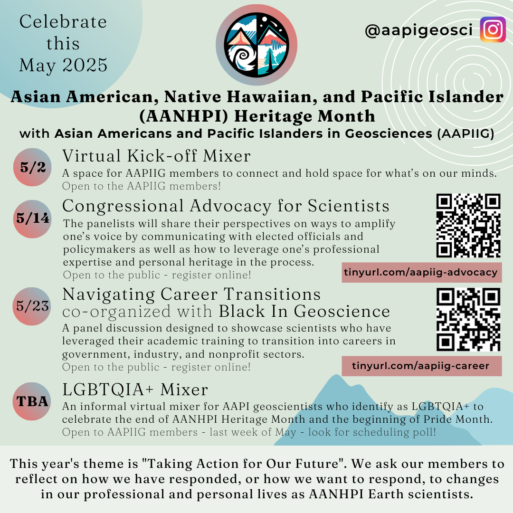
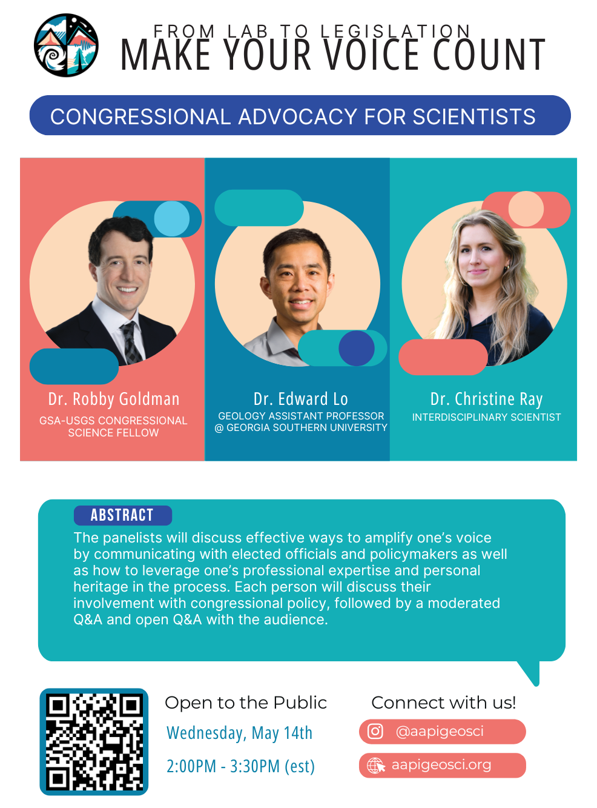

# Upcoming 2025 AANHPI Heritage Month Events

## May 02, 2025: AAPIIG Virtual Mixer

## May 14, 2025: "Congressional Advocacy for Scientists" Panel

- Wednesday, May 14, 2025, 8:00-9:30 HST / 11:00-12:30 PST / 14:00-15:30 EST
- [Register and learn more](http://www.tinyurl.com/aapiig-advocacy) 
- Three panelists will discuss effective ways to amplify one's voice by communicating with elected officials and policymakers as well as how to leverage one’s professional expertise and personal heritage in the process. Each person will discuss their involvement with congressional policy, followed by a moderated Q&A and open Q&A with the audience.
- Panelists:
  - **Dr. Christine Ray** was the 2023-24 AGI Congressional Geoscience Fellow and 2022-23 GSA Science Policy Fellow. She received her doctorate in physics from the University of Texas at San Antonio and began her journey into policy by advocating for NASA science in Congress with organizations like The Planetary Society and American Astronomical Society.
  - **Dr. Edward Lo** is an assistant professor of geology at Georgia Southern University, with a research program in sedimentary geology. Edward was a 2022 GSA/Congressional Visits Day grantee and moderated a Seminar on Indigenous Peoples with the support of Taiwan in New York in 2024 and 2025.
  - **Dr. Robby Goldman** is the current GSA-USGS Congressional Science Fellow, advising U.S. Senator Mazie K. Hirono (D-HI) on natural hazard management and STEM education and research policy. Robby received his geology doctorate from the University of Illinois at Urbana-Champaign (UIUC), and has expertise in volcanic hazard modeling and communication.
- Questions about this event can be directed to Jeemin Rhim [(jrhim@ucsb.edu)](mailto:jrhim@ucsb.edu)

## May 23, 2025: "Navigating Career Transitions" Panel co-organized by Black in Geoscience

- Friday, May 23, 12:00 pm Eastern/11:00 am Central/9:00 am Pacific, 60 minutes
- [Register and learn more](https://tinyurl.com/aapiig-career)
- This panel discussion is designed to showcase individuals who have leveraged their academic training to transition into careers in government, industry, and nonprofit sectors. As new industries and technologies come onboard, our field is rapidly evolving and new career prospects are opening outside of universities and research-based work. We envision this event as a resource for students and early-career researchers during these current times of rapidly changing outlooks on faculty and federal government hiring, and it will have a portion of time designated for audience Q&A.
- Panelists:
  - **Dr. Byron Winston** is an Environmental Scientist with a proven track record of 15+ years managing and executing environmental projects in lakes, rivers, and contaminated groundwater. He currently leads AECOM's Algae to Sustainable Agriculture program, pioneering the use of algae as a sustainable fertilizer supplement to enhance soil carbon sequestration, improve water quality, and mitigate harmful algal blooms. Dr. Winston received his Bachelors from  Midwestern State University in 2003, and Masters and PhD from University of Arkansas in Cell and Molecular Biology and Environmental Dynamics respectively.
  - **Dr. Sophie Chu** is the principal oceanographer and director of monitoring, reporting, and verification at Captura, a marine carbon dioxide removal startup company based in Pasadena, CA. She has spent over a decade developing and testing ocean carbon sensor technology to better understand carbon cycling. Prior to joining Captura, Sophie was a research scientist at the University of Washington and NOAA’s Pacific Marine Environmental Lab in Seattle, WA. Sophie has her B.S. in chemical engineering from Columbia University and Ph.D. in chemical oceanography from MIT and Woods Hole Oceanographic Institution.
  - **Dr. Kieron Prince**, Associate Professor of Geology at Broward College, is a first-generation college student and immigrant with a passion for teaching. Dr. Prince received his BSc from Loma Linda University in 2013, his MSc from Baylor University in 2015, and a PhD from Texas A&M University in 2020, where his research investigated the impacts of strong ocean-bottom currents on the alteration of carbonate sediments. 
  - **Dr. Susan Park** is the Executive Director of the Coastal and Estuarine Research Federation (CERF), an international scientific society dedicated to advancing the understanding and wise stewardship of estuarine and coastal ecosystems worldwide. Prior to this appointment, Susan was the Associate Director of Virginia Sea Grant, based at the Virginia Institute of Marine Science and College of William & Mary; Senior Program Officer with the Ocean Studies Board of The National Academies of Science, Engineering, and Medicine; Adjunct Professor at Trinity Washington University; and NOAA Coastal Management Fellow with the Massachusetts Office of Coastal Zone Management. Susan received her PhD in Oceanography from the University of Delaware, and her MA and BA in Biology from the University of Pennsylvania.
 - Questions about this event can be directed to Luan Heywood [(luan.heywood@gmail.com)](mailto:luan.heywood@gmail.com)

## Week of May 27: LGBTQIA+ Virtual Mixer update 
- Date TBA: May 27-30, online
- For AAPIIG members who identify as LGBTQIA+
- Please help us decide the time by responding before 5/16 with your favorite animal in the scheduling poll [here](https://www.when2meet.com/?30390623-UwSzH)

<!--- There are no upcoming events at this time. Explore our [event archive](https://aapigeosci.org/events/oldevents/).
-->

<!---
# LGBTQIA+ Virtual Mixer

# AAPIiG APA Heritage Month 2024 at a Glance

# Virtual Panel: Natural Disasters: Mitigation, Response, Recovery and the AANHPI Community

**Date:**
Thursday, May 9, 2024; 3:30 PM Eastern/12:30 PM Pacific/9:30 AM Hawaiʻi

**Description:**
This will be a 90 minute virtual webinar and is open to the public. We are featuring three AANHPI natural disaster experts who will discuss disaster risk and community impacts, equitable recovery following natural disasters, and hazard communication with the public and decision-makers. Our goal is to showcase scientists who have developed tangible connections between their research, affected communities and decision-makers.

**Panelists:**
- Dr. Robby Goldman is a GSA-USGS Congressional Fellow working in the office of U.S. Senator Mazie Hirono of Hawaii. Dr. Goldman’s responsibilities include monitoring Maui's post-wildfire-disaster recovery and exploring federal policies to mitigate Hawaii's risk for future wildfires. Website: https://robbygoldman.weebly.com/

- Dr. Yolanda Lin is an Assistant Professor in the Department of Geography and Environmental Studies at the University of New Mexico. Dr. Lin uses a mixed-methods approach in her work to better understand possible futures related to natural hazards and disasters. Website: https://www.yolandaclin.com/ 

- Dr. Sabine Loos is an Assistant Professor in the Civil and Environmental Engineering Department at University of Michigan. Dr. Loos applies statistical learning, risk analysis, and user-centered design techniques to develop tools that inform effective and equitable disaster risk reduction, response, and recovery. Website: https://sabine-loos.com/ 

Register [here](https://tinyurl.com/aapiig-hazards).

Questions about this event can be directed to Luan Heywood at luan.heywood@gmail.com. 

# Virtual Workshop: Exploring Personal Heritage in Academic and Professional Paths

**Date:**
Tuesday, May 28, 2024; 2:00 PM Eastern/11:00 AM Pacific/8:00 AM Hawaiʻi

**Description:**
This will be a 90 minute interactive virtual workshop and is open to the public. We are featuring three AANHPI researchers who have incorporated their personal interests and heritage into their academic work, with backgrounds in the geosciences, social sciences, and ethnic studies.

**Panelists:**
- Dr. Steven Mana'oakamai Johnson is an Assistant Professor of Natural Resources and the Environment at Cornell University who co-established a conservation-focused NGO called TÅNO, TÅSI, YAN TODU in Saipan. Website: https://www.manaoakamai.com/ and Twitter: @jah_waiian

- Amira Noeuv is a PhD Candidate in Ethnic Studies at UC San Diego who contributed a StoryMap: "Yey Sokhary's Journey" towards a project of Inter-Generational Story Mapping in the Cambodian, Native Hawaiian, and Pacific Islander Communities of Orange County. Twitter: @AmiraNoeuv

- Caroline Juang is a PhD candidate, Department of Earth and Environmental Sciences at Columbia University, who studies wildfires in the western U.S. and is active in art, digital art, illustration (for example, AAPIiG's logo and event flyers). Twitter: @caro_in_space

Register [here](https://tinyurl.com/aapiig-interests).

Questions about this workshop? Contact Thi Truong at tbtruon1@uci.edu. 
-->

<!---
# AAPIiG APA Heritage Month Panel: Allyship as AAPI Geoscientists

**Description:**
In this panel, we bring previous speakers for the Virtual ECR Lunch series to highlight a specific part of their experience as AAPI geoscientists: being allies for other marginalized groups, in addition to fellow AAPIs, within the geosciences. 

Register [here](https://tinyurl.com/APA22-panel1).

For questions, please contact Jeemin at jeemin.h.rhim@dartmouth.edu.

# AAPIiG APA Heritage Month Panel: International Scholars in Geosciences

**Description:**
Conversations and scholarship about race and structural inequity in United States academic science typically focus on U.S.-born students and scholars, for whom there is more longitudinal data collected. Immigrant scholars have distinct career narratives from U.S.-born students and scholars of color, while representing a substantial proportion of non-white geoscientists working in the U.S. This panel aims to spotlight these experiences by bringing together three earth scientists who have had transnational careers. We hope attendees will come away with insight into how international scholar experiences interplay with efforts to diversity STEM. 

Register [here](https://beav.es/APA22-panel2).

-->