# Event Archive

<b>[Jump to 2021](events/oldevents/#year-2021)</b> &nbsp;&nbsp; <b>[Jump to 2022](events/oldevents/#year-2022)</b> &nbsp;&nbsp; <b>[Jump to 2023](events/oldevents/#year-2023)</b> &nbsp;&nbsp; <b>[Jump to 2024](events/oldevents/#year-2024)</b>

2024

  

  
&nbsp;<b>May 30</b> - LGBTQIA+ Virtual Mixer

  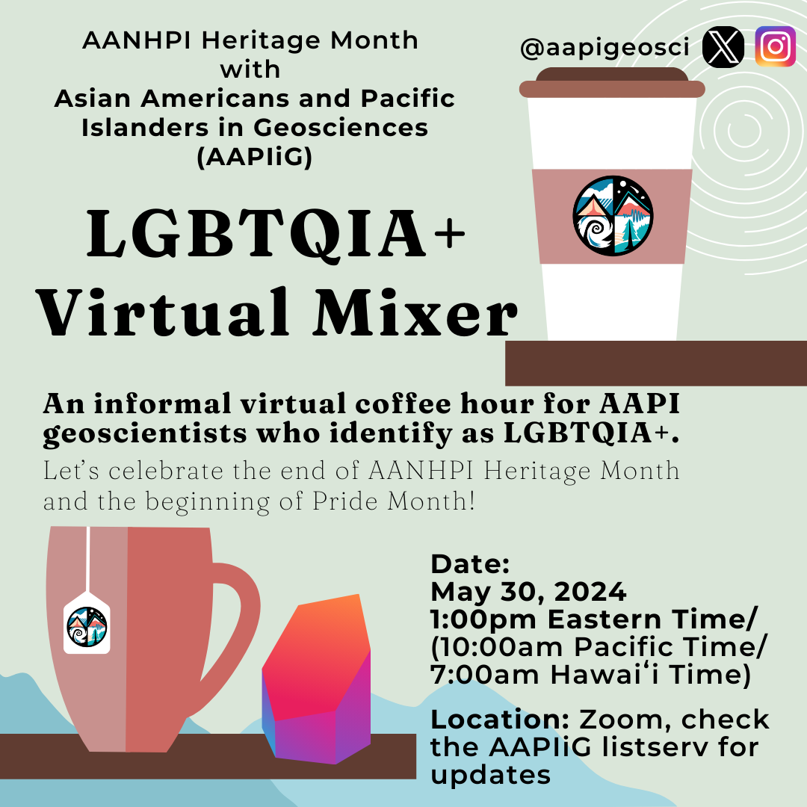

  **Date:** May 30, 2024

  **Format:** Virtual

  **Location:** Zoom

  

  

  
&nbsp;<b>May 28</b> - Virtual Workshop: Exploring Personal Heritage in Academic and Professional Paths

  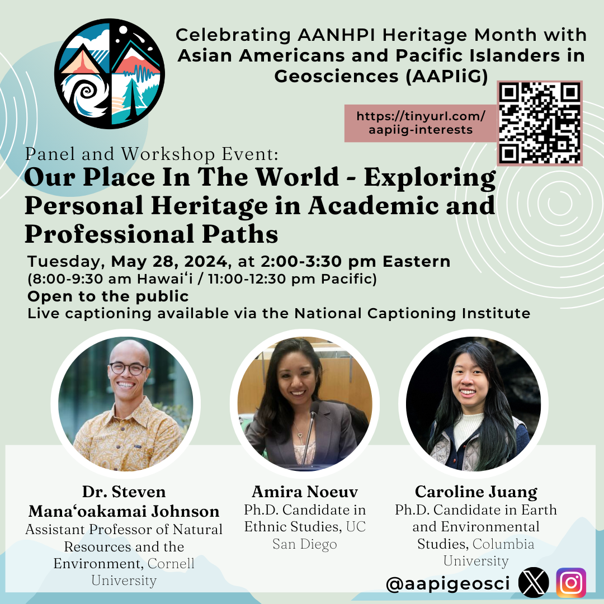

  **Date:** May 28, 2024

  **Format:** Virtual

  **Location:** Zoom

  **Description:** This was a 90 minute interactive virtual workshop and was open to the public. We featured three AANHPI researchers who have incorporated their personal interests and heritage into their academic work, with backgrounds in the geosciences, social sciences, and ethnic studies.

  **Panelists:**
  - Dr. Steven Mana'oakamai Johnson is an Assistant Professor of Natural Resources and the Environment at Cornell University who co-established a conservation-focused NGO called TÅNO, TÅSI, YAN TODU in Saipan. Website: https://www.manaoakamai.com/ and Twitter: @jah_waiian

  - Amira Noeuv is a PhD Candidate in Ethnic Studies at UC San Diego who contributed a StoryMap: "Yey Sokhary's Journey" towards a project of Inter-Generational Story Mapping in the Cambodian, Native Hawaiian, and Pacific Islander Communities of Orange County. Twitter: @AmiraNoeuv

  - Caroline Juang is a PhD candidate, Department of Earth and Environmental Sciences at Columbia University, who studies wildfires in the western U.S. and is active in art, digital art, illustration (for example, AAPIIG's logo and event flyers). Twitter: @caro_in_space
  

  

  
&nbsp;<b>May 9</b> - Virtual Panel: Natural Disasters: Mitigation, Response, Recovery and the AANHPI Community

  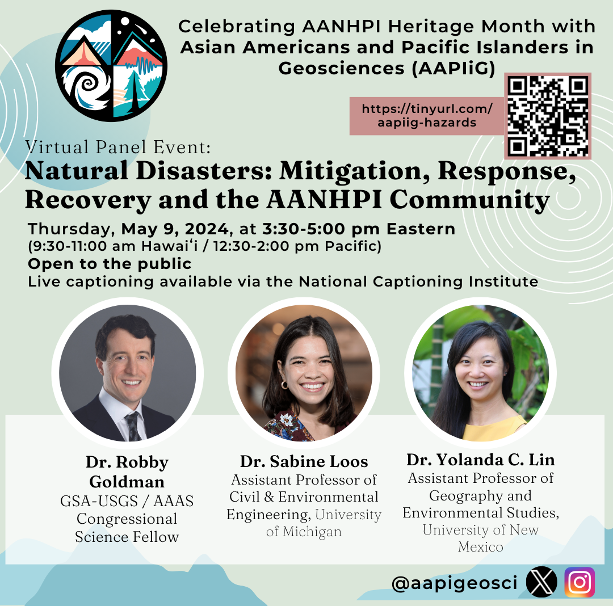

  **Date:** March 9, 2024

  **Format:** Virtual

  **Location:** Zoom

  **Description:** This was a 90 minute virtual webinar and is open to the public. We featured three AANHPI natural disaster experts who discussed disaster risk and community impacts, equitable recovery following natural disasters, and hazard communication with the public and decision-makers. Our goal was to showcase scientists who have developed tangible connections between their research, affected communities and decision-makers.

  **Panelists:**
  - Dr. Robby Goldman is a GSA-USGS Congressional Fellow working in the office of U.S. Senator Mazie Hirono of Hawaii. Dr. Goldman’s responsibilities include monitoring Maui's post-wildfire-disaster recovery and exploring federal policies to mitigate Hawaii's risk for future wildfires. Website: https://robbygoldman.weebly.com/

  - Dr. Yolanda Lin is an Assistant Professor in the Department of Geography and Environmental Studies at the University of New Mexico. Dr. Lin uses a mixed-methods approach in her work to better understand possible futures related to natural hazards and disasters. Website: https://www.yolandaclin.com/ 

  - Dr. Sabine Loos is an Assistant Professor in the Civil and Environmental Engineering Department at University of Michigan. Dr. Loos applies statistical learning, risk analysis, and user-centered design techniques to develop tools that inform effective and equitable disaster risk reduction, response, and recovery. Website: https://sabine-loos.com/ 
  

  

  
&nbsp;<b>March 14</b> - Lunar Planetary Sciences Conference Meetup in The Woodlands, TX

  

  **Date:** March 14, 2024

  **Format:** In-person

  **Location:** The Woodlands Waterway Marriott Hotel and Convention Center

  **AAPIIG Organizers:** Brendan Anzures
  

  

  
&nbsp;<b>February 23</b> - Mentoring365 Kick-Off Event

  **Date:** February 23, 2024

  **Format:** Virtual

  **Location:** Zoom

  **AAPIIG Organizers:** Mentoring Team and Waverly Lau from AGU

  **Description:** Kick-off meeting to provide detailed instructions for transitioning to the new Mentoring365 platform.
  

  

  
&nbsp;<b>February 22</b> - Ocean Sciences Meeting meetup

  **Date:** February 22, 2024

  **Format:** In-person

  **Location:** Courtyard Brewing, New Orleans, LA

  **AAPIIG Organizers:** Stephanie Lim
  

  

  
&nbsp;<b>January 25</b> - Meet the Steering Committee

  **Date:** January 25, 2024

  **Format:** Virtual

  **Location:** Zoom
  

2023

  

  
&nbsp;<b>December 13</b> - AAPIIG at AGU 2023 Offsite Mixer

  **Date:** December 13, 2023

  **Format:** In-person

  **Location:** 21st Amendment Brewery, San Francisco, CA

  **AAPIIG Organizers:** Caleb Walcott
  

  

  
&nbsp;<b>Week of Dec 11</b> - AAPIIG at AGU 2023 Recap of conference activities

  **Date:** December 11, 2023

  **Format:** In-person

  **Location:** San Francisco, CA

  **AAPIIG Organizers:** Caleb Walcott, Yihang Fang, Caroline Juang, and Christine Chen

  **Description:** We were excited to see new and familiar faces at the 2023 AGU Fall Meeting this year in San Francisco, CA! We had sunny weather all week, making it easy to trek to the convention center and to our mixers. AAPIIG said hello at AGU's "Inclusive Science for All" reception on Monday. On Tuesday, we held four Pods in the poster hall where members met each other and shared stories on a cozy circular couch. Finally, on Wednesday, we held an offsite mixer at 21st Amendment Brewery where we celebrated the mid-week conference over dinner and drinks! Thank you all for coming out and sharing your enthusiasm for science and for our community! 
  

  

  
&nbsp;<b>May 31</b> - Racial Disparities in Science Funding: Follow-up Discussion Workshop (BIPOC-only)

  **Date:** May 31, 2023

  **Format:** Virtual

  **Location:** Zoom

  **Description:** Discussion was led by AAPIIG Steering Committee and co-organizers Akilah Alwan (Graduate Research Fellow, Auburn University; National Association of Black Geoscientists) and Dr. Darryl Reano (Assistant Professor, School of Earth and Space Exploration, Arizona State University; Acoma Pueblo). This was a closed 1-hour discussion following the public talk by Dr. Christine Yifeng Chen about systemic funding disparities. This discussion made space for participants to reflect on disconnects between broader scientific culture and their identities as members of marginalized groups in the context of persistent funding disparities. 
  

  

  
&nbsp;<b>May 31</b> - Talk: "Racial Disparities in Science Funding"

  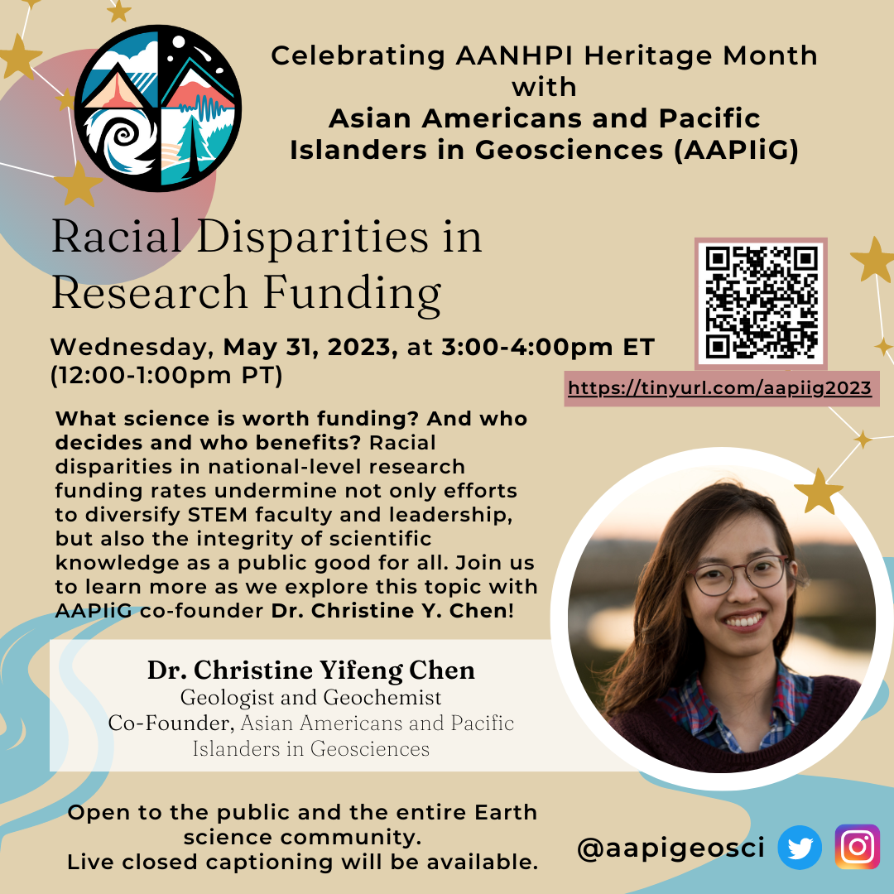

  **Date:** May 31, 2023

  **Format:** Virtual

  **Location:** Zoom

  **Description:** A public presentation by AAPIIG co-founder Dr. Christine Yifeng Chen, who was the lead author of the eLife paper "Systemic racial disparities in funding rates at the National Science Foundation", which received press in outlets such as Science, Eos, and the New York Times, as well as commentary from the broader scientific community and an invitation to the White House for the CHIPS and Science Act signing ceremony. 
  

  

  
&nbsp;<b>May 09</b> - Panel: “Navigating the Bamboo Ceiling: How AANHPI experience the glass ceiling from a social scientist and geoscientist perspective”

  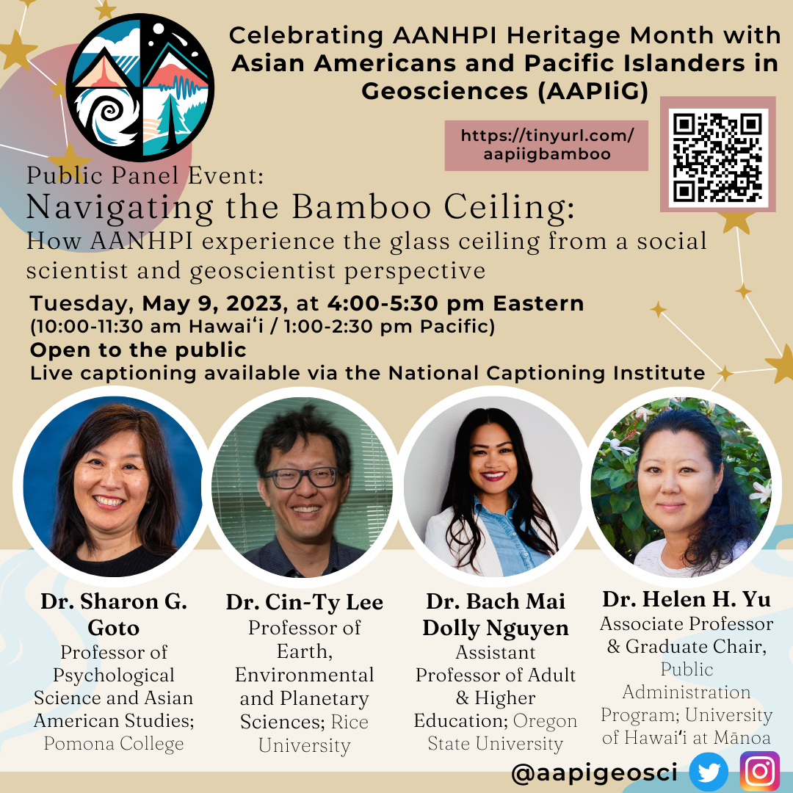

  **Date:** May 09, 2023

  **Format:** Virtual

  **Location:** Zoom

  **AAPIIG Organizers:** Co-MCs: Brendan Anzures and AAPIIG member Jenn Wong-Ala

  **Description:** Panelists: Dr. Sharon G. Goto (Professor of Psychological Science and Asian American Studies, Pomona College), Dr. Cin-Ty Lee (Harry Carothers Wiess Professor of Geology, Rice University), Dr. Bach Mai Dolly Nguyen (Assistant Professor of Education, Oregon State University), and Dr. Helen H. Yu (Associate Professor of Public Administration and Graduate Chair, University of Hawai'i at Mānoa). Highlighting the underrepresentation of AANHPI in leadership positions, the bamboo ceiling illustrates how the success of AANHPI in occupational attainment has not translated to the highest levels of leadership in both industry and academia. Learn more about what the bamboo ceiling is and how to navigate it from a panel of experts who have navigated through different structures and broad disciplines in higher education and academia!
  

2022

  

  
&nbsp;<b>December 14</b> - "AAPIIG Town Hall: Accomplishments and Future Vision" AGU Townhall

  **Date:** December 14, 2022

  **Format:** Hybrid

  **Location:** Online and McCormick Place Room S105bc

  **AAPIIG Organizers:** Caroline Juang and Jeemin Rhim

  **Description:** [Abstract link.](https://agu.confex.com/agu/fm22/meetingapp.cgi/Session/161653) This Town Hall will provide details on the vision, organization, and progress of our group thus far, as well as a space to solicit feedback on effective programming for AAPIIG going forward. This Town Hall will start with an update from AAPIIG leadership and a brief look at demographic data related to AAPI geoscientists currently provided by AGU, NSF and other organizations. There will also be ample opportunity for audience Q&A with the AAPIIG steering committee. We welcome all geosciences community members, including allies and especially those who self-identify as AAPI or individuals of Asian- and/or Pacific Islander-descent working in U.S.-based institutions, to join us.
  

  

  
&nbsp;<b>December 14</b> - AAPIIG at AGU 2022 Offsite mixer

  **Date:** December 14, 2022

  **Format:** In-person

  **Location:** Rock Bottom Brewery, Chicago, IL

  **AAPIIG Organizers:** Caleb Walcott

  **Description:** An in-person get-together for AAPIIG members attending AGU or based in Chicago. 
  

  

  
&nbsp;<b>Week of Dec 12</b> - AAPIIG at AGU 2022 Recap of conference activities

  **Date:** Week of Dec 12, 2022

  **Format:** In-person

  **Location:** Chicago, IL

  **Description:** Thank you to the ~20 AAPIIG members who attended our town hall during AGU! We recapped our mission, our past year of events (a new Board of Directors, conference in-person meetups, AANHPI Heritage Month, Early-Career Researcher (ECR) virtual lunches, new partnership with AGU Mentoring 365, the NSF GOLD-EN EAGER award that has led to the AGILE program), and shared exciting goals forward. We then had an amazing time mingling with our community at Rock Bottom Brewery in downtown Chicago. 
  

  

  
&nbsp;<b>December 07</b> - Pre-AGU/End-of-semester virtual mixer

  **Date:** December 07, 2022

  **Format:** Virtual

  **Location:** Zoom

  **AAPIIG Organizers:** Luan Heywood and Thi Truong

  **Description:** A virtual mixer for the AAPIIG-wide community, with a portion devoted towards lighting talks (~3 minutes, any number of slides or graphics) in which AGU presenters shared research with fellow AAPIIG scientists in a super supportive atmosphere!
  

  

  
&nbsp;<b>October 14</b> - Mentoring Pods Cycle 2 Kick-off event

  **Date:** October 14, 2022

  **Format:** Virtual

  **Location:** Zoom

  **Description:** We teamed up with guests from AGU Mentoring, who helped facilitate discussions about previous mentee and mentor experiences. To that end, we used terminology from Martinez-Cola (2020) on white mentors in the academy. There was time at the end for Cycle 2 pods to meet up in their own breakout rooms. There was also a general Cycle 2 breakout room for folks to mingle outside of their pod pairings.
  

  

  
&nbsp;<b>October 10</b> - AAPIIG at GSA 2022 meetup

  **Date:** October 10, 2022

  **Format:** In-person

  **Location:** Rock Bottom, Denver, CO

  **AAPIIG Organizers:** Karen Pham and Fai Chanchai
  

  

  
&nbsp;<b>October 05</b> - Pre-GSA Virtual Mixer

  **Date:** October 05, 2022

  **Format:** Virtual

  **Location:** Zoom

  **AAPIIG Organizers:** Thi Truong

  **Description:** Open to everyone, including non-GSA attendees. AAPIIG members were invited to schmooze and support GSA attendees who gave fabulous practice lightning talks.
  

  

  
&nbsp;<b>July 13</b> - AAPIIG at Goldschmidt in-person meetup

  **Date:** July 13, 2022

  **Format:** In-person

  **Location:** Hana Koa Brewing, Honolulu, HI
  

  

  
&nbsp;<b>June 12</b> - LGBTQIA+ Pride Month Virtual Mixer

  **Date:** June 12, 2022

  **Format:** Virtual

  **Location:** Zoom
  

  

  
&nbsp;<b>May 31</b> - AAPIIG-wide Virtual Mixer

  **Date:** May 31, 2022

  **Format:** Virtual

  **Location:** Zoom

  **AAPIIG Organizers:** Christine Chen

  **Description:** We discussed the content of the two APA Heritage Month panel events, discussing AAPI allyship within the geosciences community, used time for networking/catching up, etc.
  

  

  
&nbsp;<b>May 27</b> - Panel: International Scholars in Geosciences

  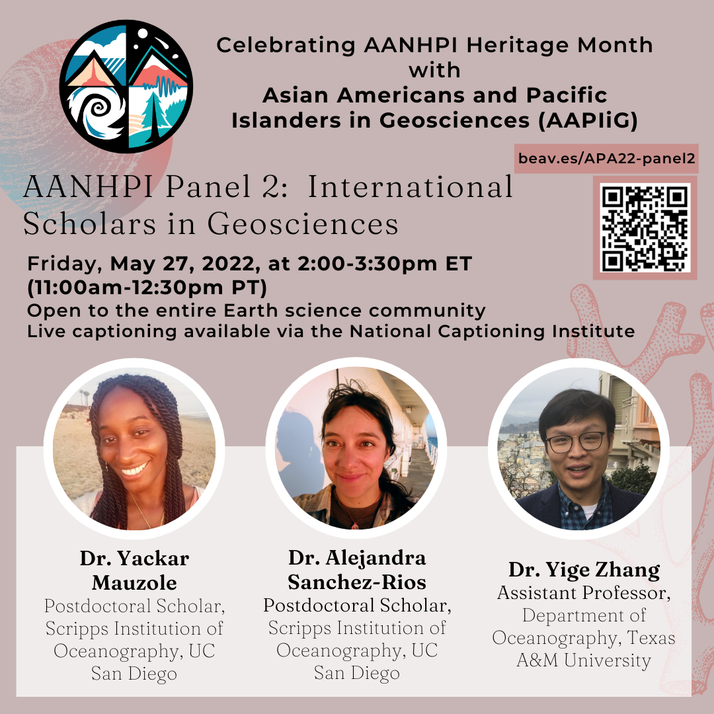

  **Date:** May 27, 2022

  **Format:** Virtual

  **Location:** Zoom

  **Description:** A panel event featuring three early-career oceanographers speaking on the topic of International Scholars in the Earth Sciences: Dr. Alejandra Sanchez-Rios, Dr. Yige Zhang and Dr. Yackar Mauzole. Conversations and scholarship about race and structural inequity in United States academic science typically focus on U.S.-born students and scholars, for whom there is more longitudinal data collected. Immigrant scholars have distinct career narratives from U.S.-born students and scholars of color, while representing a substantial proportion of non-white geoscientists working in the U.S. This panel aimed to spotlight these experiences by bringing together three earth scientists who have had transnational careers, so that attendees left with insights into how international scholar experiences interplay with efforts to diversity STEM.
  

  

  
&nbsp;<b>May 20</b> - Panel: Allyship as AAPI geoscientists

  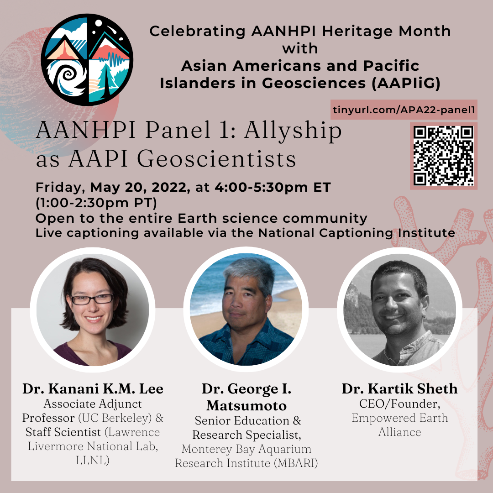

  **Date:** May 20, 2022

  **Format:** Virtual

  **Location:** Zoom

  **AAPIIG Organizers:** Jeemin Rhim

  **Description:** Panelists: Dr. Kanani K.M. Lee (Associate Adjunct Professor at UC Berkeley & Staff Scientist at Lawrence Livermore National Lab), Dr. George I. Matsumoto (Senior Education & Research Specialist at Monterey Bay Aquarium Research Institute), and Dr. Kartik Sheth (CEO/Founder Empowered Earth Alliance)
  

  

  
&nbsp;<b>May 13</b> - AAPIIG Student Mixer

  **Date:** May 13, 2022

  **Format:** Virtual

  **Location:** Zoom

  **AAPIIG Organizers:** Caleb Walcott and Kitrea Takata-Glushkoff
  

  

  
&nbsp;<b>January 31</b> - Conversation with Dr. Kartik Sheth

  **Date:** January 31, 2022

  **Format:** Virtual

  **Location:** Zoom

  **AAPIIG Organizers:** Jeemin Rhim

  **Description:** We had Dr. Kartik Sheth (Program Manager for the Science Mission Directorate at NASA Headquarters) join us.
  

2021

  

  
&nbsp;<b>December 13</b> - AGU Townhall

  **Date:** December 13, 2021

  **Format:** Hybrid

  **Location:** Online and Convention Center Room 350-351

  **Description:** [Abstract link](https://agu.confex.com/agu/fm21/meetingapp.cgi/Session/118700). Asian Americans and Pacific Islanders in Geosciences (AAPIIG) is a grassroots, member-driven organization committed to building a community that supports AAPIs within geosciences. Launched during AGU Fall Meeting 2020, we are a new organization seeking to foster a sense of community among AAPI geoscientists; empower current and future AAPI geoscientists in their career goals; embrace the diversity of both historical and contemporary experiences encompassed by communities grouped together by the AAPI categorization; and advocate for justice, equity, diversity, and inclusion issues in solidarity with other marginalized groups. This Town Hall will provide details on the vision, organization, and progress of our group thus far, as well as a space to solicit feedback on effective programming for AAPIIG going forward. This Town Hall will start with an update from AAPIIG leadership and a brief look at demographic data related to AAPI geoscientists currently provided by AGU, NSF and other organizations. There will also be ample opportunity for audience Q&A with the AAPIIG steering committee. We welcome all geosciences community members, including allies and especially those who self-identify as AAPI or individuals of Asian- and/or Pacific Islander-descent working in U.S.-based institutions, to join us.
  

  

  
&nbsp;<b>December 13</b> - AAPIIG at AGU In-person Meet-up

  **Date:** December 13, 2021

  **Format:** In-person

  **Location:** Courtyard Brewing, New Orleans, LA

  **AAPIIG Organizers:** Caleb Walcott

  **Description:** Informal mixer directly after the AAPIIG AGU townhall event to meet other AAPIIG members in person and just chat!
  

  

  
&nbsp;<b>December 09</b> - December Pre-AGU virtual mixer

  **Date:** December 09, 2021

  **Format:** Virtual

  **Location:** Zoom

  **AAPIIG Organizers:** Thi Truong

  **Description:** A portion of the virtual mixer was devoted towards lighting talks (1-2 slides or showing posters) to provide a fun and supportive environment for AGU presenters to share research with fellow AAPIIG scientists.
  

  

  
&nbsp;<b>November 21</b> - LGBTQ+ virtual get-together

  **Date:** November 21, 2021

  **Format:** Virtual

  **Location:** Zoom
  

  

  
&nbsp;<b>November 10</b> - Conversation with Dr. Yuem Park

  **Date:** November 10, 2021

  **Format:** Virtual

  **Location:** Zoom

  **AAPIIG Organizers:** Jeemin Rhim

  **Description:** The first event of a new series called Virtual ECR Lunches! This was an opportunity for early career researchers (ECRs) to connect with a "professional of the month" for a casual lunchtime conversation.  Our first professional of the month was Dr. Yuem Park, a data & earth scientist at KoBold Metals, who shared his experience with his recent transition from Ph.D. to a Data and Earth Scientist position at a startup (KoBold Metals). 
  

  

  
&nbsp;<b>October 17</b> - LGBTQ+ virtual get-together

  **Date:** October 17, 2021

  **Format:** Virtual

  **Location:** Zoom
  

  

  
&nbsp;<b>October 11</b> - AAPIIG at GSA 2021 Meetup

  **Date:** October 11, 2021

  **Format:** In-person

  **Location:** Von Ebert Brewing, Portland, OR

  **AAPIIG Organizers:** Caleb Walcott and Thi Truong

  **Description:** Asian Americans and Pacific Islanders in Geosciences' informal in-person get-together during GSA 2021 conference in Portland, Oregon.
  

  

  
&nbsp;<b>October 07</b> - Fall Pre-GSA AAPIIG Virtual Mixer

  **Date:** October 07, 2021

  **Format:** Virtual

  **Location:** Zoom

  **AAPIIG Organizers:** Luan Heywood and Thi Truong

  **Description:** Fall virtual mixer with breakout rooms for different modes of member interaction
  

  

  
&nbsp;<b>June 07</b> - AAPIIG-wide mixer #1

  **Date:** June 07, 2021

  **Format:** Virtual

  **Location:** Zoom

  **Description:** A chance to meet fellow AAPIIG members-- since launch, created a network of 300+ earth science community members in our midst. 
  

  

  
&nbsp;<b>June 05</b> - AAPIIG LGBTQ+ Pride Month Coffee Hour

  **Date:** June 05, 2021

  **Format:** Virtual

  **Location:** Zoom

  **Description:** A casual space to chat and celebrate our experiences as LGBTQ+ AAPI geoscientists, and LGBTQ+ geoscientists of Asian/Pacific-Islander descent.
  

  

  
&nbsp;<b>June 02</b> - AAPIIG Roundtable: Navigating Intersectionality and Agency in the Geosciences (Part 2)

  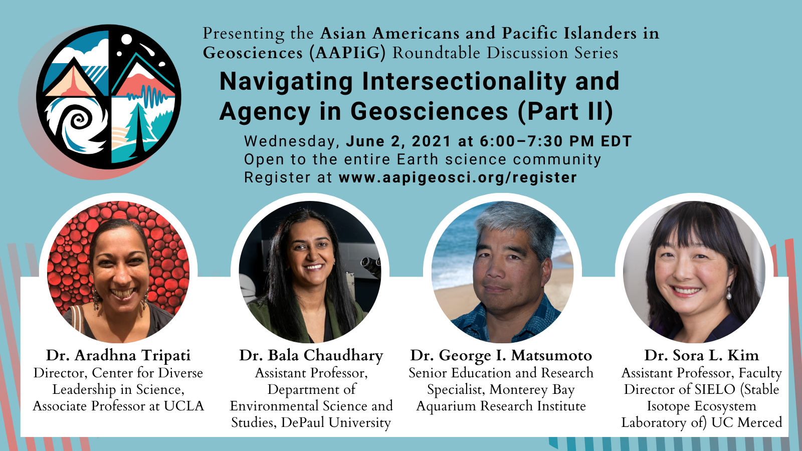

  **Date:** June 02, 2021

  **Format:** Virtual

  **Location:** Zoom

  **Description:** Panelists: Dr. Aradhna Tripati, Dr. Bala Chaudhary, Dr. George Matsumoto, Dr. Sora Kim
  

  

  
&nbsp;<b>May 21</b> - AAPIIG Student Coffee Hour #2

  **Date:** May 21, 2021

  **Format:** Virtual

  **Location:** Zoom

  **AAPIIG Organizers:** Caleb Walcott and Kitrea Takata-Glushkoff

  **Description:** Informal “coffee/tea hour” specifically for geoscience students who are AAPI or of Asian/Pacific Islander-descent in a US institution — including undergraduate students, graduate students, recent grads in transition, post-bacs, and prospective students.
  

  

  
&nbsp;<b>May 20</b> - AAPIIG Roundtable: Navigating Intersectionality and Agency in Geosciences (Part 1)

  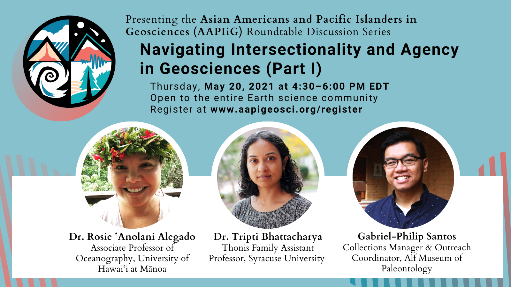

  **Date:** May 20, 2021

  **Format:** Virtual

  **Location:** Zoom

  **Description:** Panelists: Gabriel-Philip Santos, Dr. Rosie Alegado, Dr. Tripti Bhattacharya. Dr. Rosie ‘Anolani Alegado is an associate professor at the University of Hawai‘i at Mānoa who focuses on the interaction between bacteria and the adaptive potential of their ecosystem. Dr. Tripti Bhattacharya is an assistant professor at Syracuse University and her research focuses on reconstructing past climates to understand the dynamics of rainfall patterns.  Gabriel-Philip Santos is the Collections Manager and outreach coordinator at the Raymond M. Alf Museum of Paleontology who is passionate about science communication and diversity, equity, inclusion, and accessibility in science education and STEM.
  

  

  
&nbsp;<b>May 16</b> - The Historical Context of the Model Minority Myth: A Community Discussion

  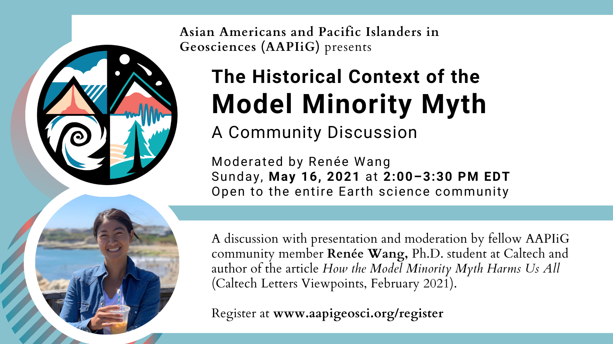

  **Date:** May 16, 2021

  **Format:** Virtual

  **Location:** Zoom

  **Description:** AAPIIG discussion of the historical context of the Model Minority Myth. Renée Wang, PhD student at Caltech and author of the article, How the Model Minority Myth Harms Us All, gave a short presentation and moderated group discussions.
  

  

  
&nbsp;<b>May 08</b> - Model Minority: Do the Math film screening and conversation with filmmaker Dr. Darby Price

  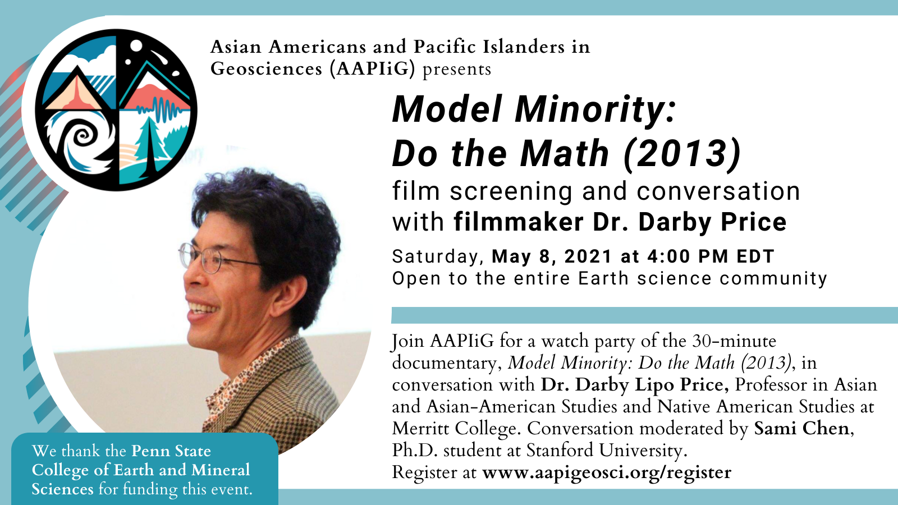

  **Date:** May 08, 2021

  **Format:** Virtual

  **Location:** Zoom

  **AAPIIG Organizers:** Sami Chen

  **Description:** AAPIIG watch party of the documentary Model Minority: Do the Math (2013) and a conversation with filmmaker Dr. Darby Price, Professor in Asian and Asian-American Studies and Native American Studies at Merritt College. Sami Chen, PhD student at Stanford and AAPIIG SC member moderated the conversation.

  [**Recording Link**](https://vimeo.com/ondemand/modelminoritydothemath)
  

  

  
&nbsp;<b>April 29</b> - AAPIIG Student Coffee Hour

  **Date:** April 29, 2021

  **Format:** Virtual

  **Location:** Zoom

  **AAPIIG Organizers:** Caleb Walcott

  **Description:** An informal “coffee/tea hour” specifically for AAPI-identifying students — including undergraduate students, graduate students, recent grads in transition, post-bacs, and prospective students.
  

  

  
&nbsp;<b>April 28</b> - Official AAPIIG Launch

  **Date:** April 28, 2021

  **Format:** Virtual

  **Location:** Online, Slack, Twitter, Instagram

  **AAPIIG Organizers:** Christine Chen, Dan Ibarra, Kim Lau, SC

  **Description:** We reached out to over 200+ STEM and Earth science departments throughout the U.S. to spread the word about AAPIIG!
  

