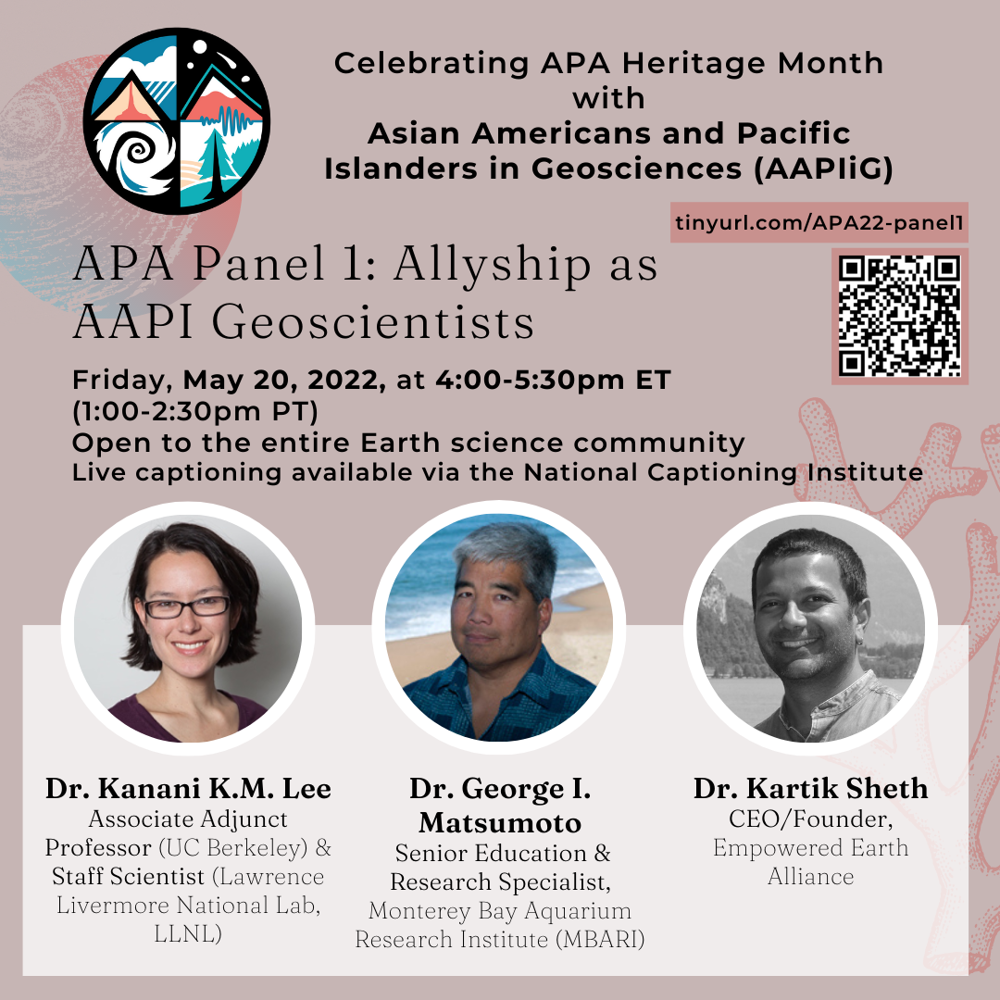

# AAPIiG APA Heritage Month Panel: Allyship as AAPI Geoscientists

**Description:**
In this panel, we bring previous speakers for the Virtual ECR Lunch series to highlight a specific part of their experience as AAPI geoscientists: being allies for other marginalized groups, in addition to fellow AAPIs, within the geosciences. 

Register [here](https://tinyurl.com/APA22-panel1).

For questions, please contact Jeemin at jeemin.h.rhim@dartmouth.edu.

# AAPIiG APA Heritage Month Panel: International Scholars in Geosciences

**Description:**
Conversations and scholarship about race and structural inequity in United States academic science typically focus on U.S.-born students and scholars, for whom there is more longitudinal data collected. Immigrant scholars have distinct career narratives from U.S.-born students and scholars of color, while representing a substantial proportion of non-white geoscientists working in the U.S. This panel aims to spotlight these experiences by bringing together three earth scientists who have had transnational careers. We hope attendees will come away with insight into how international scholar experiences interplay with efforts to diversity STEM. 

Register [here](https://beav.es/APA22-panel2).

