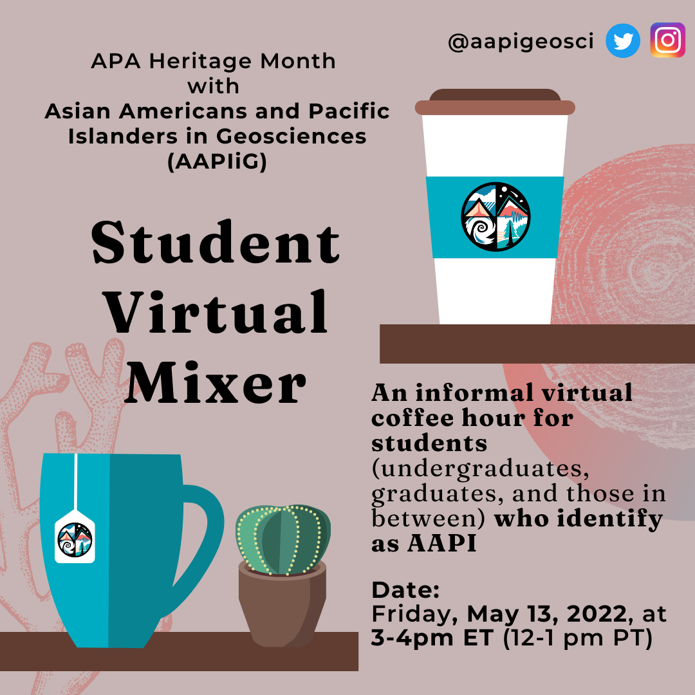
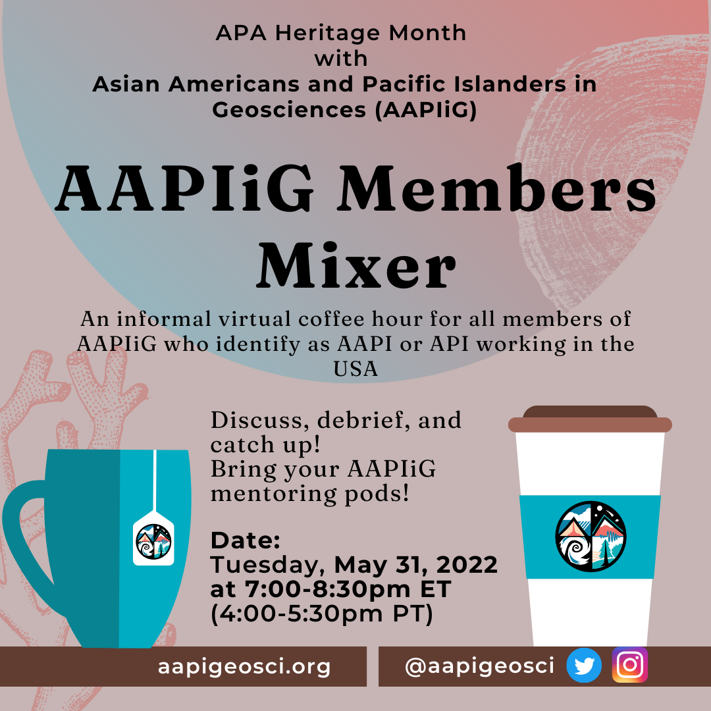

# Student Mixer

**Description:**
Open to AAPIiG students at any educational stage. 

Questions? Reach out to [Caleb Walcott](mailto:ckwalcot@buffalo.edu) or [Kitrea Takata-Glushkoff](mailto:kitreatg@gmail.com).

# AAPIiG-wide Mixer for 2022 APA

**Description:**
To end the celebration of Asian American, Native Hawaiian, and Pacific Islander Heritage Month, we will be folding a virtual mixer for the entire AAPIiG community at 4-5:30PM Pacific on Tuesday, May 31, 2022. This mixer is intended for individuals who self-identify as Asian American and/or Pacific Islander, as well as individuals of Asian- and/or Pacific Islander-descent working in U.S.based institutions. 

Come and meet other AAPIiG community members as we  catch up with old and new faces, and discuss the content of the two AANHPI Heritage Month panel events on  AAPI allyship within the geosciences community. 

For the Zoom link, please make sure you are subscribed to the AAPIiG mailing list by signing up [here](https://www.aapigeosci.org/getinvolved/joinus/). 

For questions or concerns, please contact Christine Y. Chen at cychen@llnl.gov.