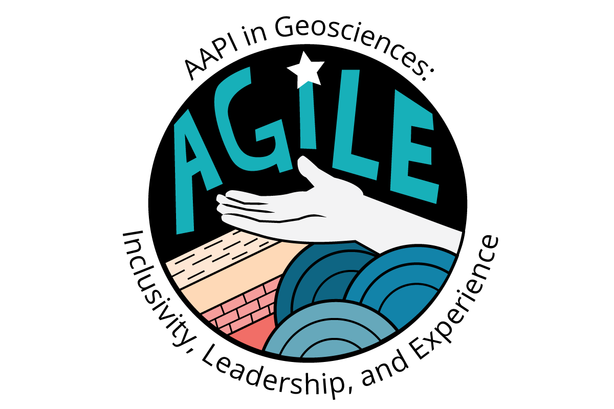

AGILE was a multi-institution project supported by an NSF GOLD-EN award that included programs to enhance participation and belonging for Asian American and Pacific Islander (AAPI) communities in geosciences.

<!--
<a href="https://sites.brown.edu/aapi-earth/" target="_blank">AGILE</a> is a multi-institution project supported by an NSF GOLD-EN award that includes programs to enhance participation and belonging for Asian American and Pacific Islander (AAPI) communities in geosciences. --->